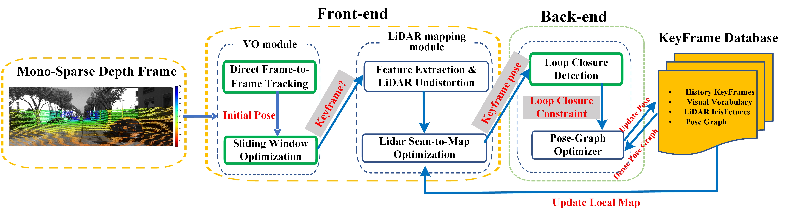

# DV-LOAM
## 1. Building dv-loam
we propose a direct vision LiDAR fusion SLAM framework that consists of three modules. Firstly, a two-staged direct visual odometry module, which consists of a frame-to-frame tracking step, and an improved sliding window based thinning step, is proposed to estimate the accurate pose of the camera while maintaining efficiency. Secondly, every time a keyframe is generated, a dynamic objects considered LiDAR mapping module is utilized to refine the pose of the keyframe to obtain higher positioning accuracy and better robustness. Finally, a Parallel Global and Local Search Loop Closure Detection (PGLS-LCD) module that combines visual Bag of Words (BoW) and LiDAR-Iris feature is applied for place recognition to correct the accumulated drift and maintain a globally consistent map. 



## 

## 2. Building dv-loam

We have tested the library in **Ubuntu 16.04** with **ROS Kinetic** and **Ubuntu 18.04** with **ROS Melodic**. A powerful computer (e.g. i7) will ensure real-time performance and provide more stable and accurate results.
A C++11 compiler is needed.

### Getting the code
Clone the repository into your catkin workspace:
```
git clone https://github.com/kinggreat24/dv-loam.git

cd ~/<ros_ws>/dv-loam

## build DBoW2
cd Thirdpary/DBoW2
cmake -DCMAKE_BUILD_TYPE=Release ..
make -j4

## build fast_gicp
cd Thirdpary/fast_gicp
mkdir build 
cmake -DCMAKE_BUILD_TYPE=Release ..
make -j4

## build Lidariris
cd Thirdpary/LidarIris
mkdir build 
cmake -DCMAKE_BUILD_TYPE=Release ..
make -j4

## build linefit_ground_segmentation
mkdir build 
cmake -DCMAKE_BUILD_TYPE=Release ..
make -j4

## build g2o
mkdir build 
cmake -DCMAKE_BUILD_TYPE=Release ..
make -j4

## build vikit_common
mkdir build 
cmake -DCMAKE_BUILD_TYPE=Release ..
make -j4

### build dv-loam
cd <ros_ws>
catkin_make -j4

```
### required libs
#### **1. ROS**
This ROS node requires catkin_make_isolated or catkin build to build. This package depends on a number of other ROS packages which ship with the default installation of ROS.
If they are not installed use [rosdep](http://wiki.ros.org/rosdep) to install them. In your catkin folder run
```
sudo rosdep init
rosdep update
rosdep install --from-paths src --ignore-src -r -y
```
to install all dependencies for all packages. If you already initialized rosdep you get a warning which you can ignore.

#### **2.Eigen3**
Required by g2o. Download and install instructions can be found [here](http://eigen.tuxfamily.org).
Otherwise Eigen can be installed as a binary with:
```
sudo apt install libeigen3-dev
```
**Required at least Eigen 3.1.0**.

#### **3.PCL-1.7**
Download and install instructions can be found [here](https://github.com/PointCloudLibrary/pcl.git).

#### **4.vikit-common**
Used for camera models. Download and install instructions can be found [here](https://github.com/uzh-rpg/rpg_vikit.git).

#### **5.Sophus**
Required by vikit-common, we use the **non-template**, Download and install instructions can be found [here](https://github.com/strasdat/Sophus.git) .

#### **6.fast-gicp**
The package is used to refine the relative transform of loop pairs.


#### **7.fadeRelease_v1.82**


### 3. Run examples
```
## run kitti
roslaunch d2vl_slam d2vl_slam_kitti.launch sequence:=05
```

### 4. To do list (in order)
- Add PGLS-LCD module
- Incorporating our previous work: a geometry-based multi-motion segmentation approach(**DymSLAM: 4D Dynamic Scene Reconstruction Based on Geometrical Motion Segmentation**) to DV-LOAM, thus eliminating the effect of moving objects and obtaining a static point cloud map. 

### 5. Acknowledgments
Thanks for 
- LOAM(J. Zhang and S. Singh. LOAM: Lidar Odometry and Mapping in Real-time) LOAM
- [A-LOAM](https://github.com/HKUST-Aerial-Robotics/A-LOAM.git)
- [iscloam](https://github.com/wh200720041/iscloam.git)
- [dvl-slam](https://github.com/irapkaist/dvl_slam.git)
- [loam-livox](https://github.com/hku-mars/loam_livox.git)
- [LiDAR-iris](https://github.com/BigMoWangying/LiDAR-Iris.git)
- ORB-SLAM2.